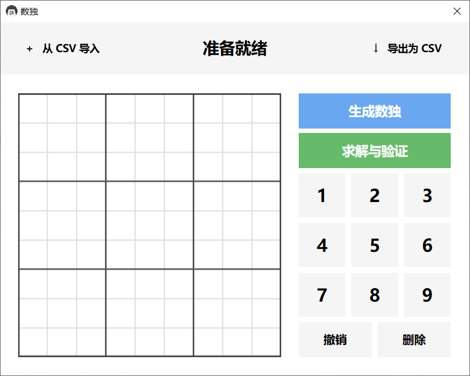
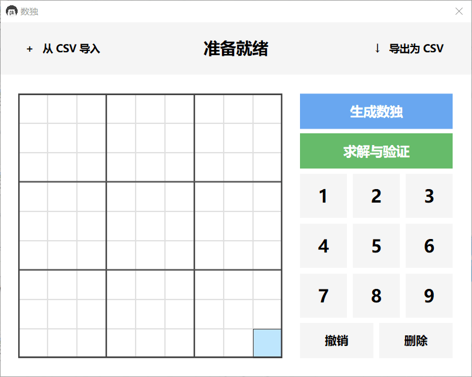

# 数独生成

人工智能课程设计，使用 C#、WPF、.NET Core 制作的数独生成器。

程序有一个看得过去的用户界面（下面有截图），使用回溯算法对数独求解，第一次用 C#，代码写的比较一般，建议仅用于学习参考。

## 功能

已经开发完成的功能：

- 生成数独
- 求解与验证数独
- 以 CSV 文件为格式的导入与导出
- 手动填入数独（进行数独游戏）
- 单步撤销（并不完善）

## 截图演示

程序部分截图及功能演示：

## 兼容性

程序运行需要 .NET Core 3.1 的支持，如果你的电脑上没有这个包，那么第一次运行的时候会提示安装。

经过虚拟机测试，在安装过 .NET Core 3.1 的 Windows 10 设备上可以正常运行；在 Windows 7 上无法打开，即使安装了依赖包， 具体原因未知，可能是一个 Bug。

## 开源协议

MIT License
